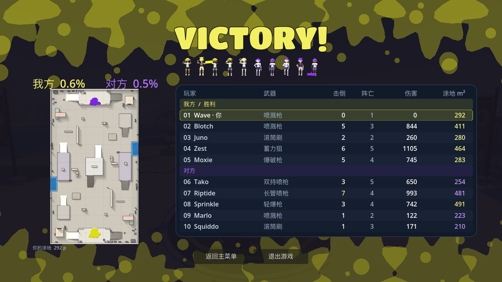

# INKWAVE Godot Demo

原版 [INKWAVE](https://github.com/caoxing9/inkwave-game) 的独立 Godot 单机源码快照。当前预览版 **v0.3.0-preview.15**，应用只支持 Apple Silicon / arm64。

默认 5v5，支持 1v1、七张地图／十九套布局、七武器／七道具／十二天赋、队友／信标跳跃，以及原版人物动作和音乐。新版放大无边框结算地图，战绩分队分列，突出玩家和最高数据；修复远程机器人射程，新增个人涂地账本。

[下载预览版](https://github.com/lmjshineee/inkwave-godot-demo/releases/tag/v0.3.0-preview.15) · [操作说明](godot-port-prototype/README.md) · [发布说明](godot-port-prototype/RELEASE_NOTES.md) · [八场自动对照](godot-port-prototype/render-evidence/match-loadouts-summary.md)

需要 Godot 4.8.dev6 与 Node.js 24。运行 `sh godot-port-prototype/run.sh`；`npm run check` 验证；`sh godot-port-prototype/export_macos.sh` 仅导出 arm64。

只保留正式 Godot 工程、必要的网页导出器来源／Three.js、许可证和验证证据，不包含网页站点、服务端、账号连接代码、缓存或人物实验。应用 ZIP、校验值与构建清单随 Release 提供。源码 83 项检查和 8 场完整 90 秒自动模拟已通过，原生结算核验包含两种窗口及真实返回按钮；真人手感、武器平衡与长期温度仍未验收。

开发源码提交：`03b82af18670cea40cddbae70432e83e36e33ffe`。文件校验与范围见 [RELEASE_SOURCE.json](RELEASE_SOURCE.json)。
